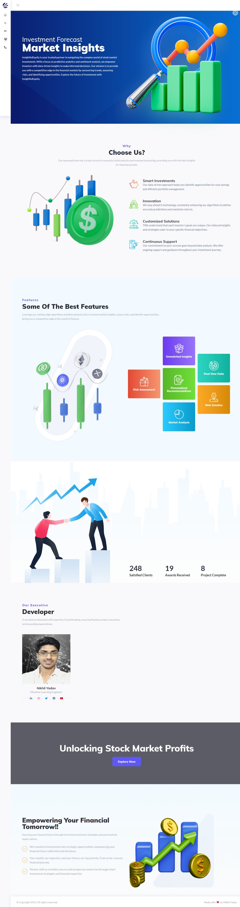
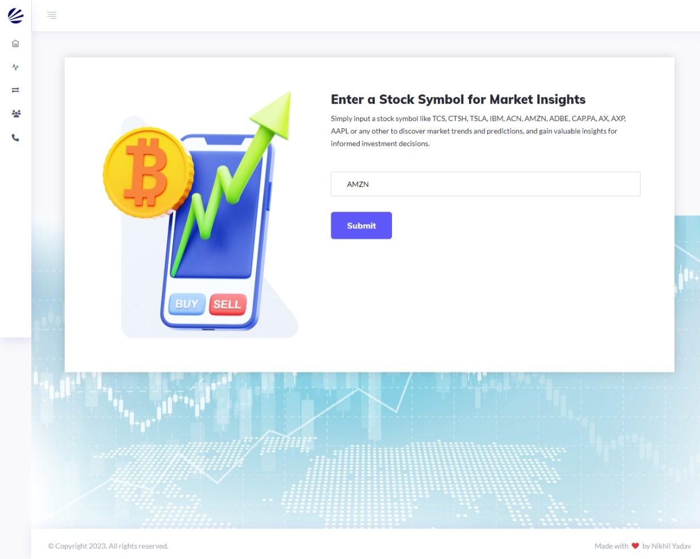
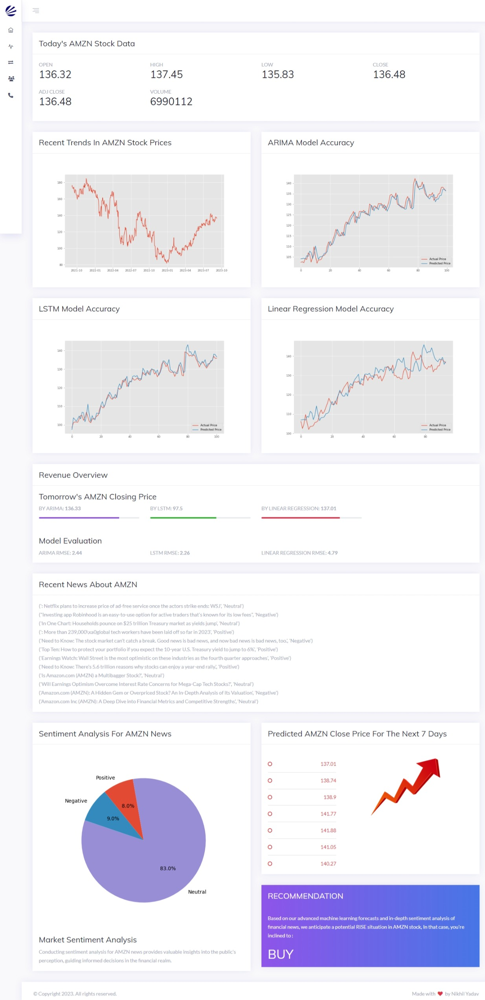

# InsightfulEquity

Welcome to the GitHub repository of InsightfulEquity, where financial intelligence meets data-driven insights.

**Project Overview:**
InsightfulEquity is a dynamic initiative designed to empower investors with actionable information, predictive analytics, and sentiment analysis. Our mission is to unravel the complexities of the financial markets and provide you with the tools you need to make informed investment decisions.

**Key Features:**
- *Data:* Gather historical financial data, market indicators, and more. Use this data to conduct your analyses or build your own financial models.

- *Predictive Analytics:* Gain a competitive edge with our predictive analytics models. We use machine learning to forecast market trends, stock prices, and other critical financial indicators, helping you stay one step ahead.

- *Sentiment Analysis:* Stay informed about market sentiment. Our natural language processing (NLP) tools analyze news articles, social media, and financial reports to gauge public opinion and its impact on stock prices.

**How to Use:**
- *Data Repository:* Explore our data repository to access historical financial data, market indicators, and more. Use this data to conduct your analyses or build your own financial models.

- *APIs and Models:* Integrate our APIs and machine learning models into your trading platforms or investment apps. Harness the power of data-driven decision-making.

- *Contribute:* We welcome contributions from data scientists, developers, and financial enthusiasts. Help us enhance our models, develop new features, or improve data sources.

**Join the Community:**
We believe in the collaborative power of the community. Join our community of data enthusiasts, traders, and investors. Share your insights, ask questions, and stay updated on the latest developments in financial data analysis.

**Get Started:**
Ready to dive into the world of financial intelligence? Clone this repository, explore our codebase, and discover the potential of data-driven investments. Together, we'll navigate the intricate world of finance, one data point at a time.

**Project Live Link:** [InsightfulEquity](http://insightfulequity.pythonanywhere.com)

Join us on this exciting journey, and let's decode the market together. 📈

#Finance #DataAnalysis #InvestmentInsights #OpenSource

---

*Home*

*Stock Predictions*

*Result*
